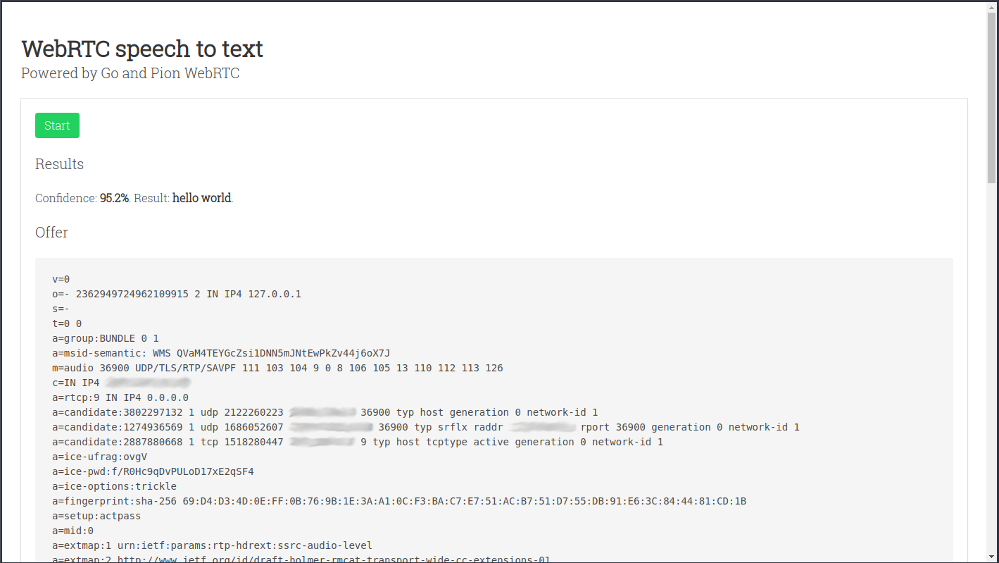
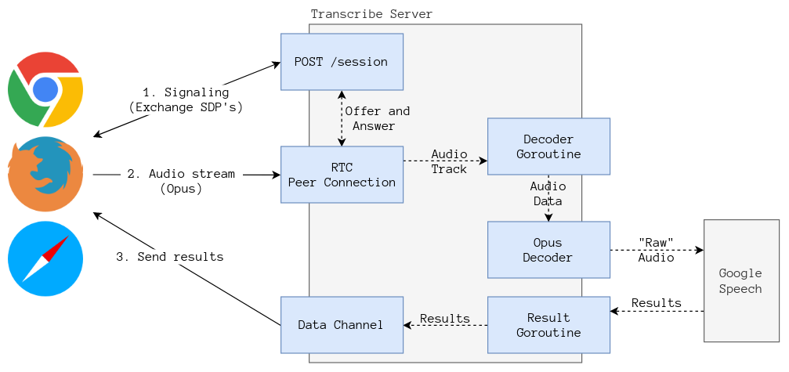

## WebRTC speech to text server

### Dependencies

The speech to text server only depends on [Go 1.12](https://golang.org/doc/install).

### Disclaimer

**This project is only a proof of concept and SHOULDN'T be deployed on a production 
environment as it lacks even the most basic security measures.**

### Build the project

The project includes a Makefile, to build execute:

```bash
make
```

This should generate a `transcribe-server` binary.

### Running the server

The server receives the following flags through the command line:

`--google.cred` (Required)

Path to a Google Cloud credential's file. The project must have Google Speech activated.

`--http.port` (Optional) 

Specifies the port where the HTTP server should listen, by default the port 9000 is used.

`--stun.server` (Optional)

Allows to speficy a different [STUN](https://es.wikipedia.org/wiki/STUN) server, by default a Google STUN server is used.

### Demo page

The demo works on Chrome 75, Firefox 67 and Safari 12.1.1



To run the demo execute the server and navigate to `http://localhost:9000`. 

After pressing the **Start** button a dialog asking for permission to access the microphone should appear. 
After grating access a WebRTC connection is made to the local server, where audio data is decoded and streamed 
to Google Speech (streaming recognition).

Say something and press the **Stop** button, the results (if any) should appear on screen.

### Architecture



### Coming soon

- Unit tests.
- Be able to specify the desired language.
- Support for interim results.

### License

MIT - see [LICENSE](LICENSE) for the full text.